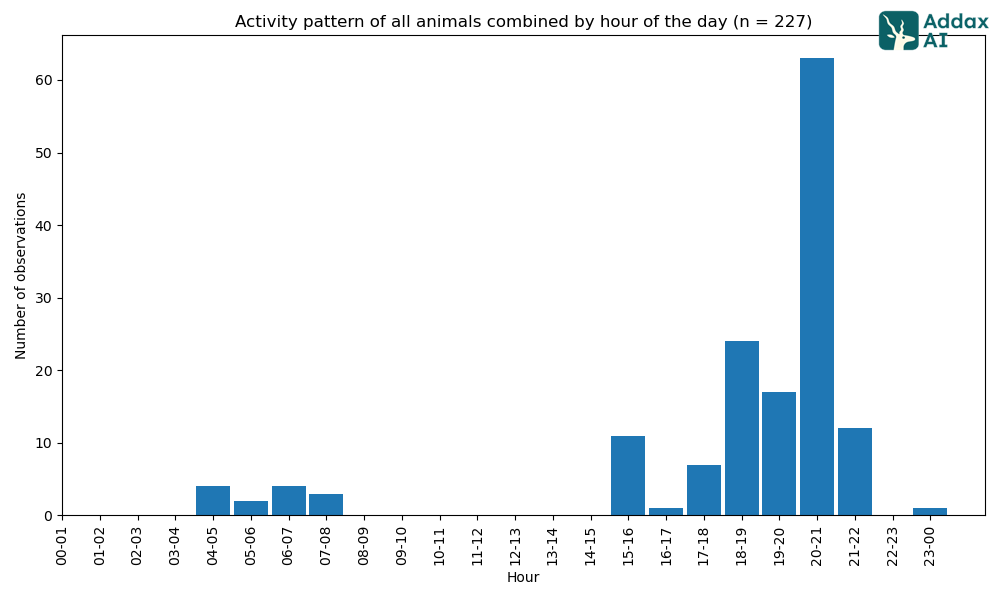
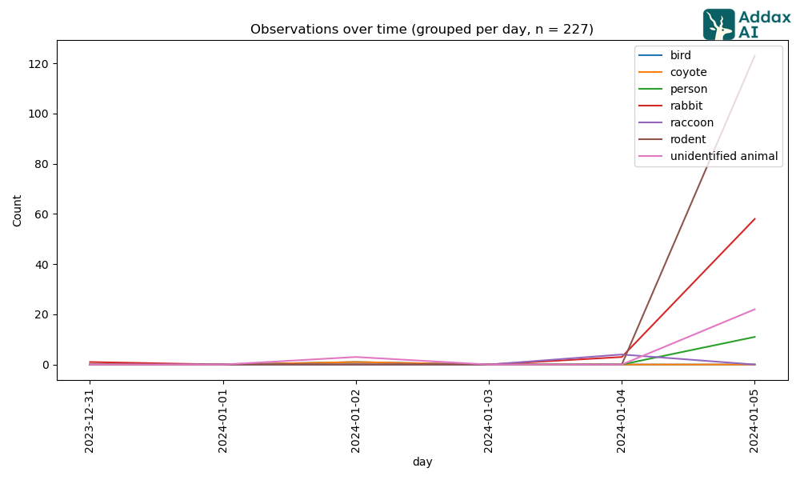

```{r setup, include=FALSE}
knitr::opts_chunk$set(echo = TRUE)
```

## Installing Portal Data

```{r}
library(portalr)
library(dplyr)
library(tidyverse)
library(lubridate)

```

```{r}
data_tables <- load_rodent_data("repo")
names(data_tables)
#week 3 making data tables

#trying to figure out which days rodents were trapped and where so I can start analyzing images

trapping_schedule <- data_tables$trapping_table
head(trapping_schedule)

jan2024_trap <- trapping_schedule %>%
  filter(year == 2024, month == 1, sampled == TRUE)

rodents <- data_tables$rodent_data
rodents_jan_11_west<- rodents %>%
  filter(year == 2024, month == 1, plot == 11)

rodents_jan_11_west

#week 2 basic R
```

# Image analysis

I am taking the Plot 11 West for the month of January and comparing it to rodents trapped.

```{r}
#I am taking the Plot 11 West for the month of January and comparing it to rodents trapped at this time, to see if there is any correlation between which animals are there and abundance of rodents
```

```{r}
file.exists("figures/graphs_2024_01_and_02_11west/activity-patterns/hour-of-day/combined.png")
file.exists("figures/graphs_2024_01_and_02_11west/bar-charts/grouped-by-day/combined-multi-layer.png")

```



 \# Combining data Sets

```{r}

addax_raw <- read_csv("addax_analysis/11west_excel/11west_results.csv")
#week one
```

```{r}
addax_clean <- addax_raw %>%
  mutate(
    plot = 11,  
    species = tolower(label),  
    date = as.Date(str_extract(relative_path, "^\\d{4}-\\d{2}-\\d{2}")),
    year = year(date),
    month = month(date),
    day = day(date)
  ) %>%
  filter(species != "unidentified animal", species != "rodent", species != "person") 
  

head(addax_clean)
```

```{r}
addax_clean <- addax_clean %>%
  select(plot, year, month, day, species, confidence)


```

```{r}
rodents_clean <- rodents %>%
  filter(year == 2024, month==1, plot == 11) %>%
  group_by(plot, year, month, day) %>%
  summarise(rodent_abundance = n())
rodents_clean

#Week 4 groups and joins
```

```{r}
# I used full_join() to combine Addax camera detections with rodent census data by date and plot, to show both results from each
combined_data <- full_join(
  addax_clean,
  rodents_clean,
  by = c("plot", "year", "month", "day")
) %>%
  mutate(date = make_date(year, month, day))
combined_data

# Week 6 tidy data
#Also week 7 dates and strings
```

```{r}
summary_data <- combined_data %>%
  group_by(species, date) %>%
  summarise(
    detections = n(),
    rodent_abundance = first(rodent_abundance),  
    .groups = "drop")

rodent_overlay <- summary_data %>%
  distinct(species) %>%
  mutate(
    date = make_date(2024, 1, 6),
    rodent_abundance = 9
  )
```

```{r}
# Week 5 data visualization
ggplot(summary_data, aes(x = date, y = detections)) +
  geom_col(fill = "steelblue", width = 0.6) +
  geom_point(
    data = rodent_overlay,
    aes(x = date, y = rodent_abundance),
    color = "darkred",
    size = 3
  ) +
  facet_wrap(~ species, scales = "free_y") +
  labs(
    title = "Addax Species Detections with Rodent Census Overlay (Jan 2024, Plot 11)",
    subtitle = "Red dot shows rodent abundance (n = 9) on Jan 6",
    x = "Date",
    y = "Detections"
  ) +
  theme_minimal()
```

#Writing a function to do plots

```{r}
plot_detections <- function(combined_data, plot_num, month_num) {
  rodent_overlay <- combined_data %>%
    distinct(species) %>%
    mutate(
      date = make_date(2024, month_num, 6),  
      rodent_abundance = 9                   
    )
  
  ggplot(combined_data, aes(x = date, y = detections)) +
    geom_col(fill = "steelblue", width = 0.6) +
    geom_point(
      data = rodent_overlay,
      aes(x = date, y = rodent_abundance),
      color = "darkred",
      size = 3
    ) +
    facet_wrap(~ species, scales = "free_y") +
    labs(
      title = paste("Addax Detections with Rodent Overlay — Plot", plot_num, month.name[month_num], "2024"),
      subtitle = "Red dot = rodent abundance (example)",
      x = "Date",
      y = "Detections"
    ) +
    theme_minimal()
}

#Week 8 wrote a function
```

Writing a function to summarise future detections that come in from other plots.

```{r}
summarize_detections <- function(data, group_col) {
  data %>%
    group_by({{ group_col }}) %>%
    summarise(detections = n(), .groups = "drop")
}
```

# Analyzing plot 21 East

#The images from 2024-02 21East and 2024-01 are combined because the dates within the folders are inaccurate


```{r}
addax_21east_raw <- read_csv("addax_analysis/results_21east.csv")


addax_21east_cleaned <- addax_21east_raw %>%
  select(relative_path, label, confidence) %>%
  mutate(
    plot = 21,
    species = tolower(label),
    date = as.Date(str_extract(relative_path, "^\\d{4}-\\d{2}-\\d{2}")),
    year = year(date),
    month = month(date),
    day = day(date)
  ) %>%
  filter(
    !species %in% c("unidentified animal", "person", "rodent", "coyote", "cow", "fox"),
    confidence >= 0.7 
  ) %>%
  select(plot, year, month, day, species, confidence, date)

addax_21east_cleaned

```

```{r}
#Filtering rodent data
rodents_21 <- rodents %>%
  filter(plot == 21, year == 2024, month == 1)

rodents_21 <- rodents_21 %>%
  group_by(plot, year, month, day) %>%
  summarise(rodent_abundance = n(), .groups = "drop") %>% 
  mutate(date = make_date(year, month, day))  
 

```

```{r}
combined_21east <- full_join(
  addax_21east_cleaned,
  rodents_21,
  by = c("plot", "year", "month", "day", "date")
) %>%
  group_by(species, date) %>%
  summarise(
    detections = n(),
    rodent_abundance = first(rodent_abundance),
    .groups = "drop"
  )

```

```{r}
plot_detections(combined_21east, plot_num = 21, month_num = 1)

#week 11
```
